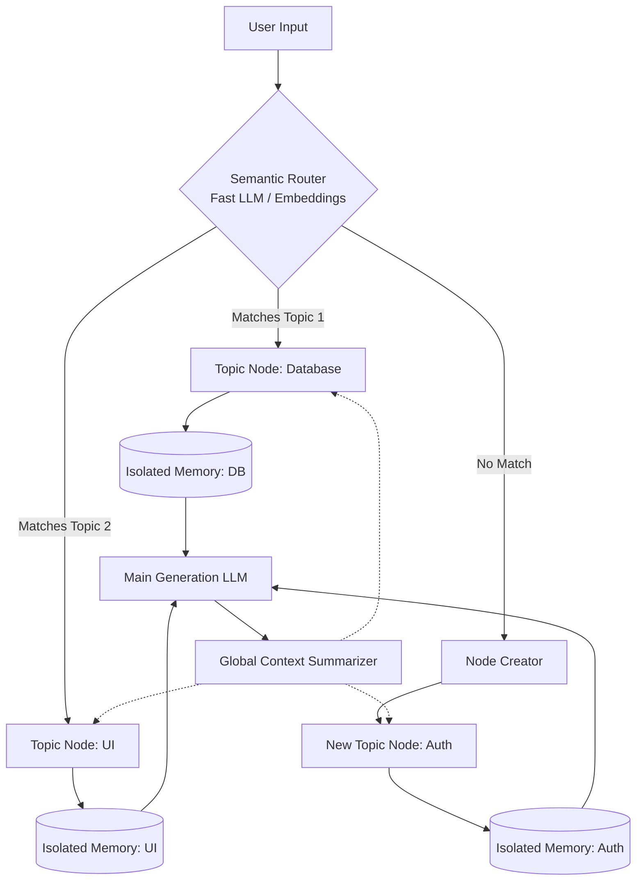
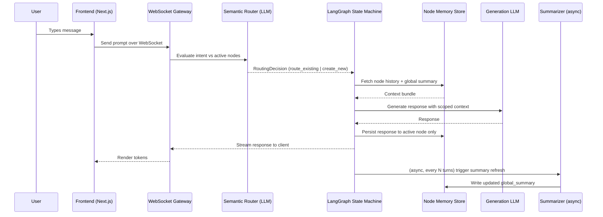
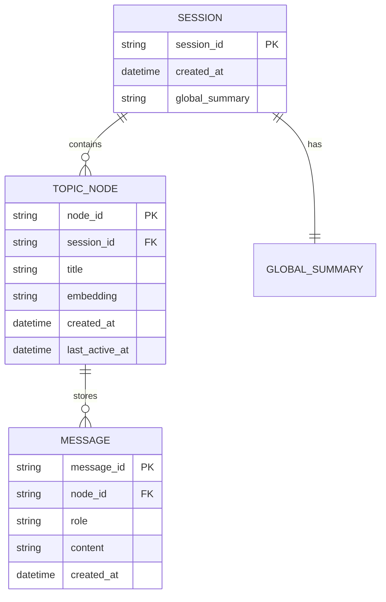
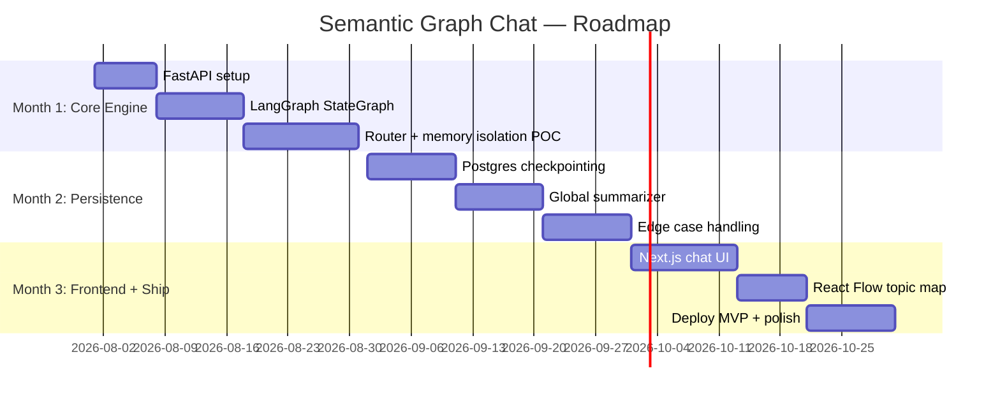

# Product Requirements Document (PRD)
## Semantic Graph Chat Architecture

| | |
|---|---|
| **Status** | Draft / In Review |
| **Owner** | AI Engineering Team |
| **Version** | 1.0 |
| **Date** | July 2026 |
| **Target Release** | Prototype v0.1 |
| **Build Tool** | Antigravity (agentic build) |

---

## 1. Executive Summary & Vision

### 1.1 The Problem
Current LLM interfaces rely on a linear, chronological chat structure. As conversations grow in complexity, this leads to:

- **Context Pollution** — the LLM forgets or misapplies earlier instructions because unrelated turns crowd the context window.
- **High Token Cost** — every request re-sends irrelevant history.
- **Poor UX** — endless scrolling through unrelated threads of conversation.

### 1.2 The Solution
The **Semantic Graph Chat Architecture** abandons linear chat. It uses a **Semantic Router** plus **LangGraph** to automatically segregate user inputs into isolated **Topic Nodes**. Each node maintains its own state and memory, so the LLM only ever sees context relevant to the immediate query.

### 1.3 Core Objective
Build a production-ready API and UI prototype that demonstrates:
1. Memory isolation between topics
2. Automatic semantic routing of new messages
3. Global context synchronization across nodes

---

## 2. Target Audience & Use Cases

**Primary audience:** software engineers, data scientists, and power users running complex, multi-step tasks with an LLM.

### 2.1 Primary Use Case — "Agentic IDE" Scenario

A developer is building a web application:

1. User discusses **database schemas** → router directs to `Node_DB`.
2. User discusses **React components** → router directs to `Node_UI`.
3. User says: *"Wait, add a `last_login` column to the User table."*
4. Router identifies this as a **database intent** → routes to `Node_DB` → loads isolated DB memory → LLM generates precise SQL without frontend hallucination bleeding in.

### 2.2 Secondary Use Cases
- Long-running research sessions with multiple parallel sub-topics.
- Multi-project consulting/support chat where a single conversation must stay disambiguated by client or system.
- Any workflow where a user context-switches frequently but expects each switch to "remember" its own thread.

---

## 3. System Architecture & Workflow

### 3.1 High-Level Block Diagram



### 3.2 Sequence Diagram — Single Turn



### 3.3 Execution Workflow (Step-by-Step)

| Step | Description |
|---|---|
| **1. Ingestion** | User submits a prompt via the frontend (WebSocket). |
| **2. Routing Phase** | A fast/cheap LLM evaluates the prompt against a dynamically generated list of Active Nodes, returning a structured `RoutingDecision`. |
| **3. State Management** | LangGraph transitions state to the identified node, or invokes a node-creation tool if the intent is novel. |
| **4. Context Assembly** | The system fetches `List[Messages]` for the active node **plus** the compact Global Summary — nothing else. |
| **5. Generation** | The heavyweight LLM generates the response using only the assembled context. |
| **6. State Persistence** | The response is appended **only** to the active node's memory store — no cross-contamination. |
| **7. Background Sync** | Every N turns, an async job refreshes the Global Context Summary so other nodes stay coherent without blocking the response. |

---

## 4. Tech Stack & Frameworks

### Backend & AI Orchestration
| Component | Choice | Notes |
|---|---|---|
| Language | Python 3.12+ | Standard for modern AI backends |
| API framework | FastAPI | Async REST + WebSocket support |
| Orchestrator | LangGraph (v0.2+) | `StateGraph`, nodes, conditional edges — preferred over linear chains for cyclical, stateful agents |
| Routing | `semantic-router` or custom LLM function-calling router | Structured-output routing, not free text |
| Router LLM | Claude Haiku 4.5 (or equivalent fast/cheap model) | Optimized for speed and low cost |
| Generator LLM | Claude Sonnet 5 (or equivalent) | Optimized for reasoning quality |

### Database & Memory Persistence
| Component | Choice | Notes |
|---|---|---|
| Vector store | PostgreSQL + `pgvector` | For embedding-based routing / long-term memory |
| Session state | Redis or LangGraph `PostgresSaver` checkpointing | Persists graph state across sessions |

### Frontend
| Component | Choice | Notes |
|---|---|---|
| Framework | Next.js 15+ (App Router) | SSR + API routes |
| Graph visualization | React Flow / XYFlow | Renders the topic-node "mind map" sidebar |
| Styling | Tailwind CSS + shadcn/ui | Fast, accessible, consistent components |

> **Note:** swap specific model names/providers freely — the architecture is provider-agnostic as long as the router supports structured/JSON output.

---

## 5. Core Features (MoSCoW Prioritization)

### Must Have (MVP)
- [ ] LangGraph backend with dynamically created nodes
- [ ] LLM-based semantic router using structured outputs (JSON)
- [ ] Isolated short-term memory per node
- [ ] Basic UI: list of active topics + current chat window

### Should Have
- [ ] Visual graph representation of topics (React Flow)
- [ ] Global Context Summarizer running asynchronously every 5 turns
- [ ] Manual routing override (user clicks a node to force context)

### Could Have / Won't Have (Future Scope)
- [ ] Multi-modal routing (route based on uploaded images)
- [ ] Multi-agent collaboration (Node A consults Node B)
- [ ] Long-term cross-session memory via `pgvector` similarity search

---

## 6. Industry Best Practices

### 6.1 Structured Output for the Router (Avoiding Silent Misrouting)
Never rely on free-text generation for routing decisions. Force valid JSON via Pydantic schemas + tool calling / structured outputs.

```python
from pydantic import BaseModel, Field
from typing import Literal, Optional

class RoutingDecision(BaseModel):
    decision: Literal["route_existing", "create_new"] = Field(
        description="Whether to route to an existing topic or create a new one."
    )
    target_node_id: Optional[str] = Field(
        description="The ID of the node to route to, if routing to existing."
    )
    reasoning: str = Field(
        description="Brief explanation of why this route was chosen."
    )
```

### 6.2 Managing the "Latency Tax"
The router adds overhead on every turn. To minimize perceived latency:
- Stream a "Routing…" indicator to the frontend immediately.
- Use WebSocket connections rather than HTTP polling.
- Keep the router model small/fast — it only needs to classify, not reason deeply.

### 6.3 State Conflict Management
Maintain a `global_summary` string in the LangGraph state definition, updated **asynchronously** by a background node so it never blocks the main chat response.

```python
from typing import TypedDict, Annotated, List
import operator

class GraphState(TypedDict):
    global_summary: str
    active_node_id: str
    nodes: dict  # node_id -> that node's chat history
    current_input: str
```

### 6.4 Additional Recommendations
- **Idempotent node creation** — dedupe near-duplicate topics (e.g. "Auth" vs "Authentication") with an embedding-similarity check before calling the Node Creator.
- **Bounded memory per node** — cap each node's history (e.g. rolling window + periodic in-node summarization) to control token growth even within a single topic.
- **Observability** — log every routing decision (input, decision, confidence/reasoning) for offline evaluation of router accuracy.
- **Graceful fallback** — if the router is unsure, default to the currently active node rather than spawning a spurious new one.

---

## 7. Data Model (Reference)



---

## 8. API Surface (Reference)

| Method | Endpoint | Purpose |
|---|---|---|
| `WS` | `/ws/chat/{session_id}` | Main chat stream (send prompt, receive tokens + routing metadata) |
| `GET` | `/api/sessions/{session_id}/nodes` | List active topic nodes for the sidebar graph |
| `GET` | `/api/nodes/{node_id}/messages` | Fetch a node's isolated message history |
| `POST` | `/api/nodes/{node_id}/force-route` | Manual override: pin the next message to this node |
| `GET` | `/api/sessions/{session_id}/summary` | Fetch current global summary |

---

## 9. Implementation Plan (3-Month Roadmap)



| Month | Focus | Deliverables |
|---|---|---|
| **1** | Core Engine (Backend) | FastAPI running; `StateGraph` defined; router proven via terminal tests to correctly isolate memory |
| **2** | Persistence & Refinement | Postgres checkpointer wired in; global summarizer live; ambiguous-prompt edge cases handled |
| **3** | Frontend Integration & Polish | Next.js chat UI; React Flow topic map; MVP deployed (Vercel/Render); demo deck ready |

---

## 10. Success Metrics

| Metric | Target |
|---|---|
| Routing accuracy (manual eval set) | ≥ 90% correct node assignment |
| P50 added routing latency | < 400ms before generation begins |
| Cross-topic context leakage (manual audit) | 0 observed instances in MVP demo |
| Token cost vs. linear-chat baseline (long session) | ≥ 30% reduction |

---

## 11. Open Questions
- Do we need per-node access control (e.g. share only the "UI" node with a teammate)?
- Should node embeddings be recomputed as a node's content grows, or frozen at creation?
- What's the merge/split UX when two nodes turn out to be the same topic?
